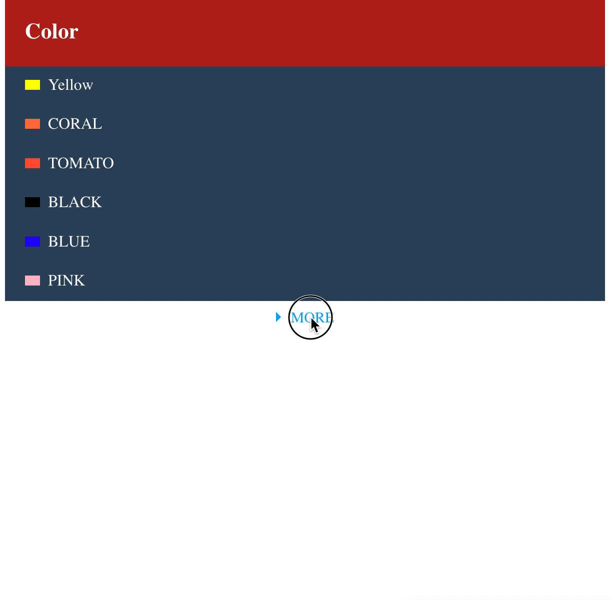

# vue-simple-collapse

Install

```js
npm i vue-simple-collapse --save
```

Use

```html
<template>
  <div>
    <div class="header">Color</div>
    <vue-collapse :initCount="initCount" :list="list">
      <template slot-scope="{item, index}">
        <div class="item">
          <span :style="{ background: item.hex }"></span>{{ item.name }}
        </div>
      </template>
    </vue-collapse>
  </div>
</template>
<script>
require('vue-simple-collapse/dist/index.css')
import VueCollapse from 'vue-simple-collapse/dist'

export default {
  components: {
    VueCollapse
  },
  data: function () {
    return {
      list: [
        { name: 'Yellow', hex: '#FFFF00'},
        { name: 'CORAL', hex: '#FF7F50'},
        { name: 'TOMATO', hex: '#FF6347'},
        { name: 'BLACK', hex: '#000000'},
        { name: 'BLUE', hex: '#0000FF'},
        { name: 'PINK', hex: '#FFC0CB'},
        { name: 'GREEN', hex: '#008000'},
        { name: 'WHITE', hex: '#FFFFFF'},
        { name: 'RED', hex: '#CD5C5C'},
        { name: 'SNOW', hex: '#FFFAFA'},
        { name: 'INDIGO', hex: '#4B0082'}
      ],
      initCount: 5 // Default display 6 count items, please set it if you need display more or less count.
    }
  }
}
</script>
```

Demo



